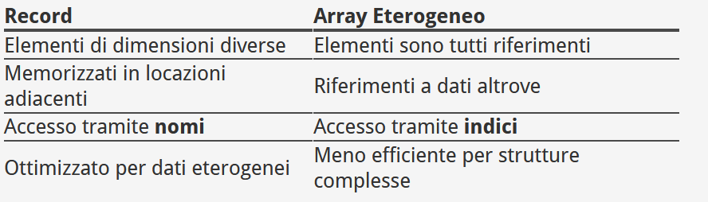
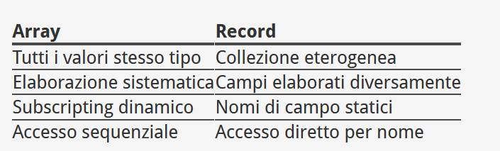
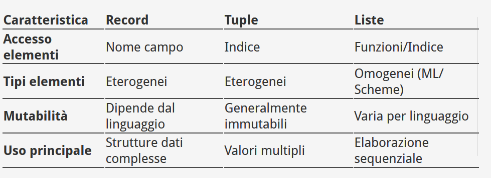

									
# Table of Contents

1.  [Stringhe](#orgc7ff6a7)
    1.  [Tipo stringa nei linguaggi di programmazione](#org33516ef)
    2.  [Lunghezza delle stringhe](#orgb43be5a)
    3.  [Implementazione dei Tipi di Stringhe](#org78f1247)
    4.  [Allocazione/Deallocazione?](#org6a42bf1)
2.  [Array](#org3cf6248)
    1.  [Indicizzazione degli array](#orgc94976f)
    2.  [Categorie di Array](#org95d97d4)
    3.  [Inizializzazione degli array:](#org47d8905)
    4.  [Operazioni sugli array (che lavorano sugli array come unita&rsquo; singola)](#org9d7a5b1)
    5.  [Array Rettangolari e Jagged](#org08201af)
    6.  [Slice](#org5b073e3)
    7.  [Implementazione degli Array](#org0eb07f4)
3.  [Record e Liste](#orge5d87c0)
    1.  [Record vs array eterogenei](#org3e26ab7)
    2.  [Riferimenti qualificati vs ellettici??????](#orgd50bc68)
4.  [Tuple](#orgd6101e6)
    1.  [Caratteristiche principali](#orge844f69)
    2.  [Tuple nei vari linguaggi](#orga746bd1)
    3.  [List comprehensions](#orgeda275a)
        1.  [Python](#orgd764431)
        2.  [Haskell](#orge94ef55)
    4.  [Confronto tra i vari tipi strutturati visti fino ad ora](#org3ce894a)
        1.  [Implementazione](#orgb24477e)


<a id="orgc7ff6a7"></a>
# Intro
- Un **tipo di dato** definisce una collezione di valori che quel dato puo' assumere e un set di operazioni predefinite su tale valore
- Un **descrittore** e' la collezione di attributi di una variabile
- Un **tipo di dato astratto** e' un tipo la cui interfaccia e' visibile dall'utente ma la sua definizione e set di operazioni no.
- Un **oggetto** e' un instanza di un tipo definito dall'utente (tipo astratte)
Alla fine, la progettazione di ogni tipo di dato deve rispondere alla seguente domanda:
> [!question]
> Quali operazioni e valori sono definite e come vengono specificate?
# Tipi di dati primitivi
Tipi di dato che non possono essere rappresentati/scomposti con altri sono detti **primitivi**. Una buona parte dei tipi di dato primitivi sono delle rappresentazioni pressoche' esatta dell'hardware.  

## Tipi di dati numerici
## Interi
La maggior parte dei linguaggi (e anche dell'HW) supportano almeno queste dimensioni di interi:
- byte
- short
- int 
- long
i quali sono anche rappresentazioni con segno. Ma alcuni linguaggi supportano anche gli **unsigned integer** che sono appunto rappresentazioni senza segno, quindi sempre con valori positivi.

## Virgola mobile
Cercano di modellare i numeri reali, ma sono con un approssimazione. Rappresentati tramite la rappresentazione in notazione scientifica di _mantissa + esponente_.

La maggior parte dei linguaggi supporta due tipi per i valori in virgola mobile: **float e double**. I float sono rappresentati in 4 bytes, double in 8 e si usano solitamente dove abbiamo bisogni di piu' range frazionale oppure un maggiore range per gli esponenti

## Complessi
Alcuni linguaggi supportano tipi di dati per la rappresentazione di **numeri complessi**. Solitamente rappresentati con due valori _float_ che rappresentano parte reale e parte immaginaria.

## Decimali
Rappresentano valori con un numero fissato di cifre decimali, con la virgola impostata ad una posizione pre-decisa all'interno del valore.
- Vantaggio: permette di rappresentare con precisione i valori decimali anche se all'interno di un range ristretto, cosa che come abbiamo visto non puo' essere fatto con i valori float.
- Svantaggio: il range di valori rappresentati e' ristretto, perche' l'esponente non esiste e quindi la loro rappresentazione spreca un po' di spazio.

Le cifre decimali vengo rappresentate tramite una forma codificata: **BCD: binary coded decimali**, solitamente 1 byte per ogni cifra decimale o per ogni due.
> [!example]
> Servono almeno 4 bit per rappresentare una cifra decimale, quindi servono almeno 24 bit per rappresentare un valore a 6 cifre decimali ma servono solo 20 per rappresentare lo stesso valore in binario.
# Stringhe

Sappiamo che sono una sequenza di caratteri. Ci sorgono pero'; subito dei problemi di progettazione del tipo *stringa* (visibili poi anche in base alla
diversa implementazione dei linguaggi)

-   *E' un tipo primitivo o solo un array particolare?*
-   *La sua lunghezza e' fissa oppure dinamica?*

Sulle stringhe, le operazioni tipiche sono:

-   Assegnamento e copia
-   Confronto
-   Concatenazione
-   Riferimento a sottostringhe
-   Riconoscimento di pattern

## Tipo stringa nei linguaggi di programmazione

Se le stringhe non sono definite come tipo primitivo allora sono solitamente
degli array di char. Esattamente cio'; che fa **C/C++**, anche molte delle loro
funzioni di libreria permettono di manipolare le stringhe proprio in forma di
array di char.

> [!example]
Esempio primitivo invece e' **Java** (ma anche python). In java le stringhe sono
oggetti primitivi immutabili

Alcuni linguaggi mi danno anche un support nativo per le operazioni di pattern matching con espressioni regolari:
- Perl
- JavaScript
- Ruby
altri invece le supportano con librerie.
<a id="orgb43be5a"></a>
## Lunghezza delle stringhe

Non c'e molta scelta:
-   **Statica**: definita nell'atto di creazione della stringa, poi immutabile. E' il
    caso di Java, Python, Cobol. In quel caso il descrittore e' necessario solo in fase di compilazione
-   **Dinamica Limitata**: C e C++. In questo caso essendo che non c'e' un limite,
    esiste un carattere terminatore '\0' che indica la fine della stringa
-   **Dinamica senza limite**: Perl, Javascript,...;
<a id="org78f1247"></a>
## Implementazione dei Tipi di Stringhe
Potrebbero essere gestite direttamente in HW, tuttavia nella maggior parte dei
casi si adotta una manipolazione software.
Servono degli opportuni descrittore di tipo, per tutti i tipi di stringa
-   Statica $\to$ descrittore a tempo di compilazione. Di solito questo descrittore
    ha questi campi:
    -   type: Static String
    -   Length
    -   Address del primo carattere
-   Dinamica limitata $\to$ puo' necessitare di un descrittore a tempo di esecuzione
    (non e' il caso di C e C++). Di solito questo descrittore ha questi campi:
    -  Type: Limited Dynamic String
    -   Maximum Length
    -   Current Length
    -   Address
     e solitamente e' necessario un solo step di allocazione della lunghezza massima della stringa.
-   Dinamica illimitata $\to$ necessita di un descrittore a tempo di esecuzione e
    gestire allocazione/deallocazione non e' facile. Di solito ha questi campi:
    -   Type: Limited Dynamic String
    -   Current Length
    -   Address
<a id="org6a42bf1"></a>
## Allocazione/Deallocazione?
Per cio' che riguarda i primi due casi di stringa, non c'e' bisogno di nessuna
particolare attenzione e possono essere allocate staticamente. (una sola fase di allocazione di spazio necessario per la lunghezza massima della stringa.)
Per le stringhe dinamiche illimitate invece, la dimensione non e' nota a priori.
Per gestirle si possono intraprendere tre strade:
1.  **Linked Lists**: Flessibile ma grande overhead per lettura/scrittura ma le quando una stringa viene "allungata" lo si puo' fare tranquillamente con un allocazione sullo heap e un aggiunta alla linked list.
2.  **Array di puntatori a singoli caratteri**: Flessibile, piu' veloce delle liste
    ma sempre un costo notevole in termini di memoria
3.  **Memorizzazione di caratteri in celle adiacenti** con un puntatore al primo
    carattere. Quando la memoria non basta piu', la si sposta in un altra zona
    dello heap allocando quelle precedenti. *Al momento questo e'; l'approccio piu' usato*
<a id="org3cf6248"></a>
## Enum (in breve)
Tutti i valori possibili, che sono costanti nominate, vengono fornite nella definizione stessa nell'enum. Un esempio di enum:
```C#
days {Mon, Tue, Wed, Thu, Fri, Sat, Sun};
```
e nella maggior parte dei linguaggi, ogni costante di enumerazione viene associata internamente ad un valore intero nell'ordine di definizione 0, 1, ...
# Array
E una collezione di elementi omogenei in cui un singolo elemento e' identificato dalla sua posizione dell' aggregato, relativa al primo elemento.
I singoli elementi di un array devono essere dello stesso tipo.
In linguaggi staticamente tipizzati:

-   Se l' array contiene dei puntatori o reference, allor anche tutti questi devono puntare allo stesso tipo

In altri linguaggi invece dinamicamente tipizzati (perl, python,...):
- le variabili sono riferimenti senza tipo a degli oggetti e non hanno un tipo fisso, pertanto un array di riferimenti ad oggetti, contiene oggetti diversi perche' sono tutti puntatori ma potrebbero puntare ad oggetti di tipi differente

>[!caution] Rimangono comunque omogenei, sono tutti riferimenti

Alcuni problemi di progettazione degli array potrebbero essere:
- Quali tipi sono validi per gli indici?
- L'intervallo nelle espressioni di indicizzazione e' controllato oppure no?
- In quale momento vengono associati gli intervalli degli indici (nelle operazioni di indicizzazione)?
- Quando viene fatta l'allocazione in memoria degli array?
- Sono permessi array jagged e/o rettangolari?
- Quando gli array vengono allocati e' possibile anche inizializzarli?
 <a id="orgc94976f"></a>
## Indicizzazione degli array

E' una mappatura da indici a elementi, un modo di accedere un elemento di un array.
Senza accorgencene ci sono sempre due coinvolti in un array: il **tipo degli elementi dell'array** e **il tipo ammesso negli indici**.
Lo abbiamo gia' visto e sappiamo cosa e', ma vediamo come diversi linguaggi lo implementano:

-   Sintassi degli indici: FORTRAN e Ada usano parentesi. C, C++, C#, ... usano le
    []
-   Tipi per gli indici: FORTRAN, C, Java, &#x2026; solo interi. Ada qualsiasi tipo
    ordinale, anche non primitivo
-   Controllo dell' intervallo degl indici: C,C++,Perl e Fortran non lo
    specificano, Java, C# e ML invece si infine in Ada invece e&rsquo; opzionale.
<a id="org95d97d4"></a>
## Categorie di Array e Binding degli Indici
Il tipo degli indici e' chiaramente statically bound ma il range degli indici alle volte e' dinamico.
Esistono 5 categorie di array basate sul :
- binding del range degli indici
- Il binding nella memoria
- Dove viene allocata memoria 
 e sono:
-   **Statici**: gli indici sono associati staticamente e l'allocazione delle memoria
    e' statica (prima del tempo di esecuzione). In quanto statica, l'array avra'
    la stessa dimensione per tutta la  durata del programma. Esempio:
    -   array in *C e C++* con la keyword **static**
	- _vantaggio:_ sono molto efficienti, non serve allocazione/deallocazione 
	- _svantaggio:_ la loro dimensione non puo' variare durante l'esecuzione del programma
-   **Stack-dinamici fissi**: gli indici sono associati staticamente ma l' allocazione
    viene effettuata al momento dell' elebarazione della sua dichiarazione a
    run-time. Deallocati poi una volta fuori scope.
    Esempi:
    -   Array in *C e C++* senza modificatori
    - _vantaggio:_ efficienti in termini di memoria, in quanto due array di grandi dimensioni in due sottoprogrammi diversi possono usare lo stesso spazio nella memoria se i due sottoprogrammi non sono attivi contemporaneamente
    - _svantaggio:_ e' necessario tempo e operazioni per l'allocazione e la deallocazione.
-   **Stack-dinamici**: sia intervalli di indici che l'allocazione sono dinamici,
    quindi legati al momento dell' elaborazione. Sicuramente molto flessibili in
    quanto la dimensione dell' array non e' nota fino a quando non viene elaborata
    la sua dichiarazione
-   **Heap-dinamici fissi**: la loro dimensione e' fissata al momento dell' allocazione
    e poi non cambia piu' e viene allocato sullo heap. I binding della memoria e degli indici e' fatto dinamicamente, cioe' quando richiesto dal programmatore. Piu' flessibili di quelli stack dinamici, in quanto sopravvivono anche all' uscita dalla funzione pero' piu' difficili da gestire. Esempi:
    -   *Java e C#*
-   **Heap dinamici**: gli intervalli di indici e l' allocazione della memoria sono
    dinamici. La sua dimensione puo' cambiare un numero di volte qualsiasi durante
    l'esecuzione del programma. Molto flessibili ma complessi e costosi in termini
    di tempo. Esempi:
    -   *Perl*
    -   *Javascript*
<a id="org47d8905"></a>
## Inizializzazione degli array:
Alcuni linguaggi permetto di inizializzare un array al momento della sua allocazione in memoria.
-   Fortran 95 permette di specificare un array delimitato da parentesi e '/'
    -   Integer, Dimension(3) : : List = (*0, 3, 5*)
-   C, C++, Java, Swift e C# permettono tutti di inizializzare i propri array
    -   int list [] = {4, 5, 7, 83}; // lunghezza fissata e controllata in Java, ma non in C!
-   Come già discusso, le stringhe di caratteri in C e C++ sono implementate come
    array
    -   char name [] = &ldquo;freddie&rdquo;;  // otto elementi, incluso &rsquo;\\0&rsquo; di terminazione
-   Array di stringhe in C e C++: possono essere inizializzati con stringhe;
    l' array sarà un pointer a char
    -   char \*names [] = {"Bob", "Jake", "Darcie"} // names[i] punta a "B", "J","D"
-   Simile a inizializzazione Java di oggetti String: String[] names = {&ldquo;Bob&rdquo;,
    &ldquo;Jake&rdquo;, &ldquo;Joe&rdquo;};
-   In Ada e' un po' piu'particolare. Ada fornisce due meccanismi: elencandoli
    nell' ordine in cui devono essere memorizzati oppure assegnandoli direttamente
    a una posizione di indice usando l'operatore =>
    -   List: array(1..5) of Integer := (1,3,5,7,9);
    -   Bunch: array(1..5) of Integer := (1 => 17.3, 3 => 34, others => 0)
<a id="org9d7a5b1"></a>
## Operazioni sugli array (che lavorano sugli array come unita' singola)

Assegnamento, Concatenazione, Confronto.

-   C, C++, Java, C# non supportano operazioni native sugli array
-   Perl supporta l'assegnamento
-   **Ada**:
    1.  Supporta l'assegnamento
    2.  Concatenazione tra due array e tra 1 array e 1 scalare (operatore &)
    3.  Uguaglianze e disuguaglianze
-   **Python**:
    1.  Gli array in realta' sono Liste, quindi array dinamici
    2.  Sono eterogenei, possono contenere oggetti di qualsiasi tipo (perche' abbiamo visto come in python gli array sono composti da puntatori ad oggetti, quindi ogni puntatore puo' essere correlato a qualsiasi tipo di oggetto)
    3.  Supporta le operazioni di assegnamento, concatenazione(+) e appartenenza (in)
    4.  Supporta il confronto con **is** e == (il primo controlla se e' lo stesso oggetto con l'id, l'ultimo fa il confronto con tutti gli elementi dell'array)
-   **Ruby**:
    1.  Array come riferimenti. Gli elementi in realta'sono riferimenti ad oggetti
    2.  Supporta l' operatore == che restituisce true solo se:
        -   I due array hanno la stessa Lunghezza
        -   Gli elementi corrispondenti sono uguali
    3.  Supporta la concatenazione con il metodo **Array**
-   **Fortran 95+**
    1.  Potenti operazioni su array e **operazioni** elementari (cosi chiamate) tra coppie di elementi di Array.
        Es: A + B risulta in un array delle somme delle coppie di elementi di A e B
    2.  Definiti operatori assegnamento, aritmetici, relazionali, logici
    3.  Funzioni di libreria per Moltiplicazione matriciale, Trasposizione di matrici
-   **F# con il suo modulo array**
    Tanti operatori tra i quali:
    1.  Array.append per la Concatenazione
    2.  Array.copy
    3.  Array.Length
    4.  ...
-   **APL**
    -   E' il linguaggio piu' potente per l'elaborazione di array. Sono definite delle operazioni aritmetiche di base per Vettori e matrici ma anche per scalari.
        Es: A + B valido per A, B scalari, vettori e matrici.
    -   Esempi di operatori unari (V = vettore, M = matrice)
        -   ⌽V: inverte gli elementi di V
        -   ⌽M: inverte le colonne di M
        -   ⊖M: inverte le righe di M
        -   ⍉M: traspone M (righe diventano colonne)
        -   ⌹M: inverte M
    -   Operatori speciali: **Prodotto Interno** (.) *E' un operatore strano che prende due operatori binari come altri operatori*. Esempio:
            +.x $\to$ Moltiplica elementi corrispondenti e poi somma i risultati
<a id="org08201af"></a>
## Array Rettangolari e Jagged
Gli **array rettangolari** sono letteralmente la rappresentazione di matrici mxn, mentre gli array **Jagged** sono degli array multidimensionali in cui le righe possono avere lunghezza diversa

> [example]
> - C++,C e Java supportano gli array Jagged ma non supportano gli array rettangolari nativamente, perche' anche le matrici mxn sono array di array.
> - Fortran, Ada, C#, F# supportanno array rettangolari
> - C#, F# supportano sia array rettangolari che array Jagged.


> [!caution]
> Generalmente, gli array Jagged sono supportati ogni volta che gli array multidimensionali sono trattati come array di array.

Gli array sono ovviamente piu' complessi dei tipi primitivi e hanno bisogno di gestire diverse cose, come:
- Serve un codice di accesso generato a compile-time
- Per accedere ad un certo elemento, e' necesssario calcolare un indirizzo a run-time
	- Dato una certa operaazione list[k], non esiste un modo per precomputare l'indirizzo in modo da accedere ad esso.
Solitamente, la funzione di accesso ad un dato elemento funziona nel seguente modo:

`address(list[k]) = address(list[0]) + k * element_size`
Questo nel caso in cui l'array abbia lower bound statico, quindi sia sempre 0. In altri linguaggi, dove e' supportato il lower bound arbitrario, la funzione cambia in funzione di esso insieme al suo descrittore run-time: (il descrittore non serve se tutti gli attributi sono statici e non viene fatto il controllo dei range a run-time)
Il descrittore conterra':
- Array
- Element Type
- Index Type
- Index Lower Bound
- Index Upper Bound
- Address
e la funzione:
```address(list[k]) = address(list[lower_bound]) + ((k - lower_bound) * element_size)```
>[!question] Come vengono mappati in memoria i vari array?

Esistono 2 tecniche ma entrambe finiscono per 'srotolare' in 1Dimensione l'array in memoria:
-   Row Major Mode $\to$ , si scrivono gli elementi in memoria seguendo l'ordine delle righe
-   Column Major Mode $\to$, si scrivono gli elementi in memoria seguendo l'ordine delle colonne
Vediamo ora come calcolare l'indirizzo di accesso per una cella di memoria in un array multidimensionale:
-   Con lower bound = 0: $M[i,j] = address(M[0,0] + (((i \* n)+ j) \* element<sub>size</sub>)), dove _n_ e' il numero di elementi per riga
-   Con lower bound arbitrari: $address(M[row\_lb, col\_lb] + (((i - row\_lb)* n + (j - col\_lb) * element\_size)$
<a id="org5b073e3"></a>
## Slice
E' una sottostruttura di un array gia' esistente il quale referenzia una parte di quell'array come unita'.

> [!caution] Di base non e' niente di nuovo, ma per esistere, il linguaggio deve dare la possibilita' di manipolare un array come unita'

    Data una matrice A, se prendo la prima riga ho uno slice,
    se prendo l'ultima riga ho uno slice ...
vediamo alcuni esempi di certi linguaggi: 
> [!example]
> - Python
> ```Python
> vector = [2, 4, 6, 8, 10, 12, 14, 16] mat = [[1, 2, 3], [4, 5, 6], [7, 8, 9]]
> # slice
> vector[3:6] → [8, 10, 12] (elementi 3, 4, 5)
mat[1] → [4, 5, 6] (seconda riga completa)
mat[0][0:2] → [1, 2] (primi due elementi della prima riga)
vector[0:7:2] → [2, 6, 10, 14] (ogni altro elemento escluso il 7 a partire da zero, a salti di 2)
> ```
> - Ruby
> ```Ruby
> list = [2, 4, 6, 8, 10]
Singolo parametro: list.slice(2) → 6
Due parametri: list.slice(2, 2) → [6, 8] (inizio, numero elementi)
Range: list.slice(1..3) → [4, 6, 8]
> ```
<a id="org0eb07f4"></a>
## Implementazione degli Array

Sono sicuramente piu&rsquo; difficili da implementare rispetto ai tipi primitivi. La parte fondamentale e&rsquo; **l&rsquo;accesso**. Il compilatore non puo&rsquo; sapere a quale indirizzo vorremo accedere a runtime e deve quindi generare il codice corretto per far si che (a runtime) il processore calcoli l&rsquo;indirizzo corretto da noi richiesto. Generalmente la formula e&rsquo; una cosa simile: $address(list[k]) = address(list[0]) + k * element_size$.
Oppure, gli array vengono salvati con dei *lower bound arbitrari*, e la formula a quel punto cambia $address(list[k]) = address(list[lower<sub>bound</sub>]) + ((k - lower<sub>bound</sub>) \* element<sub>size</sub>)
Se e&rsquo; necessario il controllo del range degli indici, a quel punto entra in campo anche un descrittore che contiene i seguenti campi:

-   Array
-   Element Type
-   Index Type
-   Index Lower Bound
-   Index Upper Bound
-   Address
<a id="orge5d87c0"></a>
# Record e Liste
Un record e' un aggregato di dati in cui i singoli elementi (campi) sono identificati da nomi e accessibili tramite un offsset a partire dall'inizio della struttura.
I dati sono solitamente di tipo e dimensione diverse e sono raggruppati sotto un unica entita' logica

    L'esempio che salta piu' all'occhio e' sicuramnente
    quello delle struct in C

ma anche altri linguaggi le supportano: COBOL, Algol, Pascal,... (come record), ML e F# (come struct)
_Array_ e _record_ sono entrambi collezioni di oggetti ma la differenza fondamentale e' il metodo di accesso agli elementi:
- Si fa accesso agli elementi negli array tramite indice 
- Nelle struct o record si accede agli elementi medianti degli **identificatori** che, appunto, identificano i campi del record
<a id="org3e26ab7"></a>
## Record vs array eterogenei


I record presentano diversi vantaggi rispetto ai record eterogenei:
-   Design diretto e sicuro
-   Accesso efficiente tramite nomi statici dei campi
-   Ogni campo e' posizionato in memoria tramite offset relativo dall'inizio del record, a differenza degli array allocati sullo heap i cui elementi possono essere tranquillamente sparsi in giro nella memoria.

 Quando e' bene usare i record? 
 - Quando la collezione di dati da rappresentare e' chiaramente eterogenea
 - Quando i diversi campi devono essere elaborati in modi diversi
 - Quando i campi non necessitano di essere elaborati in un certo ordine


### Accesso ai campi nei record
Diversi linguaggi adoperano sintassi differenti ma le piu' comuni sono:
- struct.field
- struct["field"] (tipico di lua questo )
- struct->field
Quello piu' strano e' quello di COBOL:
- Si usa la keyword _OF_ specificando poi di volta in volta i campi secondo la gerarchia di definizione
```COBOL
01 EMPLOYEE-RECORD.
   02 EMPLOYEE-NAME.
      05 FIRST PICTURE IS X(20).
      05 MIDDLE PICTURE IS X(10).
      05 LAST PICTURE IS X(20).
   02 HOURLY-RATE PICTURE IS 99V99.
```
Quindi se dovessi accedere al "middle-name" di un certo impiegato dovrei fare:
- MIDDLE _OF_ EMPLOYEE-NAME _OF_ EMPLOYEE-RECORD
<a id="orgd50bc68"></a>
### Riferimenti completamente qualificati vs ellettici 
- _Completamente Qualificati:_ includono **tutti** i nomi di record intermedi, a partire dal record piu' grande (quello piu' in alto nella gerarchia) fino al campo specifico da noi richiesto
	- Example: ```Employee.Record.Employee_Name.Middle```
- _Riferimenti Ellittici:_ il campo richiesto e' nominato ma alcuni record contenitori (quelli piu' in alto nella gerarchia) possono essere omessi, **purche' il riferimento sia non ambiguo**
	- Example: FIRST, FIRST OF EMPLOYEE-NAME, FIRST OF EMPLOYEE-RECORD

> [!caution]
> Sono convenienti per il programmatore ma richiedono strutture dati complessi nel compilatore per la loro gestione e riducono la leggibilita'
<a id="orgd6101e6"></a>
# Tuple

Una tuple e' simile ad un record (quindi dati eterogenei) ma gli elementi non sono nominati. Sono acessibili tramite posizione/indice.
<a id="orge844f69"></a>
## Caratteristiche principali

-   Immutabili
-   Possono contenere elementi di tipi diversi
-   Utilizzate per restituire valori multipli da funzioni
-   Utili quando un array deve essere protetto da scrittura
<a id="orga746bd1"></a>
## Tuple nei vari linguaggi
**Python**:

-   supporta le tuple, dichiarabili con: *myTuple = (3, 5.8, apple)* (differenti dalle liste che si dichiarano con [])
- Gli elementi non devono essere dello stesso tipo
-   Sono Immutabili
-   Indicizzazione a partire da 0 e accesso tramite []
-   Operazioni supportate: concatenazione(+), cancellazione, funzioni list() e tuple() per la conversione *tuple<->list*
- CI si accede con myTuple[i]

## Liste: Lisp
E' il primo linguaggio funzionale a supportare le liste. Solitamente la sintassi di dichiarazione di lisp e' questa:

-   (A B C D)   ;Lista semplice
-   (A (B C) D) ; Lista annidata

> [!caution]
> Lisp e' un linguaggio funzione in cui praticamente tutto ha la stessa sintassi quindi (A B C D) puo' essere siamo una lista oppure una chiamata di funzione ad A con parametri B e C

Operazioni fondamentali:

-   (CAR '(A B C)) ;Restituice A (primo elemento)
-   (CDR '(A B C)) ;Restuisce BC(resto della lista)
-   (CONS 'A '(B C)) ;Restituisce (A B C)
-   (LIST 'A '(C D)) ;Restituisce (A B (C D))
<a id="orgeda275a"></a>
## List comprehensions

E' un meccanismo potente che permette di creare array/list. E' derivato dalla notazione degli insiemi, apparso per la prima volta in Haskell
<a id="orgd764431"></a>
### Python
Ha la seguente sintassi: [ expression **for** iterate<sub>var</sub> **in** array if **condition** ]

    [x * x for x in range(12) if x % 3 == 0] # Restituisce [0,9,36,81]
<a id="orge94ef55"></a>
### Haskell
Ha la seguente sintassi: [body | qualifiers]

    [n * n | n <- [1..10]] --> Lista di Quadrati da 1 a 10
<a id="org3ce894a"></a>
## Confronto tra i vari tipi strutturati visti fino ad ora



> Quando si usa cosa?

-   **Record**: Strutture dati complesse con campi correlati
-   **Tuple**: per restituire valori multipli
-   **Liste**: collezioni di dati omogenei, elaborazione funzionale
<a id="orgb24477e"></a>
### Implementazione
-   I record vengono memorizzati con i lori campi in posizioni adiacenti in memoria. L'accesso avviene tramite offset precompilati. Il controllo dei tipi e' a *compile-time*
-   Le tuple vengono memorizzati simili ai record con i loro elementi indicizati. L'accesso a indice diretto oppure a pattern matching. Possibilmente potrebbe essere anche allocate sullo Stack
-   Per le liste dipende dal linguaggio:
    -   Lisp/Scheme sono liste Concatenate
    -   Python sono array dinamici
    -   ML sono liste immutabili Concatenate
per questo motivo le prestazioni non sono generalizzabili.

